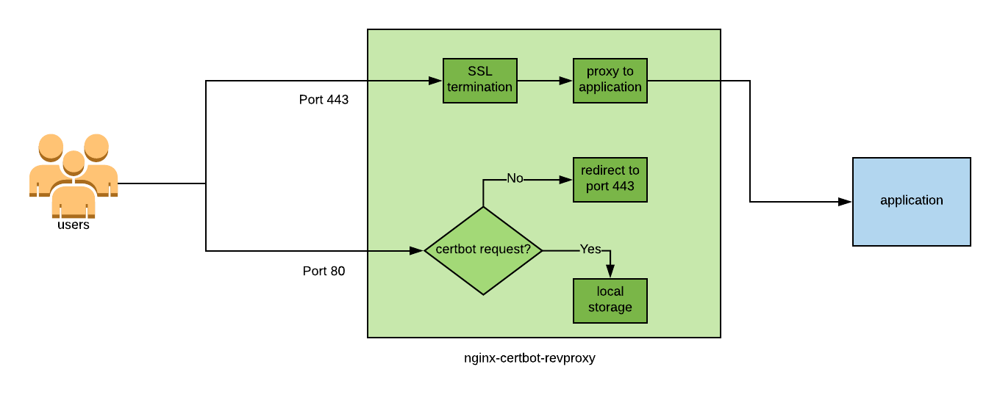

# What can this image be used for?

This image provides an easy way to add Let's Encrypt certificate protection to any existing web application or service. It provides good defaults for TLS handling inside nginx and also listens on HTTP2 (and proxies back to HTTP/1.0 or 1.1).

# How does it work?

It works by running nginx inside the container (for TLS termination) and locally answering all Let's Encrypt related requests. All other requests are proxied to the backend. A renewal process runs in the the background, trying to renew the certificate every 2 weeks (but also on every container start).



# How to use this image

Start your application's backend. Take note of the port the application listens on. The port does not have to be exposed for the setup to work. For example:

```bash
$ docker inspect -f '{{ .NetworkSettings.Ports }}' my_backend
map[8080/tcp:[]]
```

If your backend and nginx-certbot-revproxy run in the same user-defined network you can use skip the next step.

If your backend is *not* running in a user defined network (not recommended)- take note of the IP address of the container:
```bash
$ docker inspect -f '{{ .NetworkSettings.IPAddress }}' my_backend
172.17.0.4
```

Start the nginx-certbot-revproxy container:

```bash
$ docker run --name nginx-certbot-revproxy \
    -e DOMAIN={YOUR_DOMAIN} \
    -e EMAIL={YOUR_EMAIL} \
    -e BACKEND={BACKEND_IP}:{BACKEND_PORT} \
    -p 80:80 \
    -p 443:443 pshemk/nginx-letsencrypt-revproxy:latest
```

Please note that with no persistent storage the image will regenerate the DH parameters for TLS every time, which can take a long time.

# Persistent storage

It's suggested to mount a volume inside the container to store the letsencrypt certificate and the DH parameters:

```bash
$ docker run --name nginx-certbot-revproxy \
    -e DOMAIN={YOUR_DOMAIN} \
    -e EMAIL={YOUR_EMAIL} \
    -e BACKEND={BACKEND_IP}:{BACKEND_PORT} \
    -p 80:80 \
    -p 443:443 \
    -v /var/nginx-letsencrypt-revproxy:/etc/letsencrypt/ \
    pshemk/nginx-letsencrypt-revproxy:latest

```

# Environment

The following environmental variables are used:
* DOMAIN - the domain on which the proxy listens, this string is used in the Let's Encrypt request
* EMAIL - email address passed to Let's Encrypt for notifications
* BACKEND - the address/name and port of the application backend
* STAGING - a flag that tells the image to use the staging Let's Encrypt server. 

# Backend specification

Backend is placed in the nginx configuration file 'as is'. The resolution happens at run time, so the backend container doesn't have to be running at the time the nginx-certbot-revproxy is started. It's possible to specify a backend on a different host too, either by using a name or IP address.

If the backend container and nginx-certbot-revproxy run in a user-defined network (which is the recommended way) the internal Docker DNS allows for resolution of container names to IP addresses, so there's no risk of IP address change when you delete and re-create the backend container.

If after starting your backend and nginx-certbot-revproxy you see the following error message in your browser:
```
502 Bad Gateway
```
then most likely your backend settings are misconfigured. 

# Container start process

When started for the first time this is the typical output of the container:

```
2018-11-16 23:22:48,756 CRIT Server 'unix_http_server' running without any HTTP authentication checking
checking for existing certificates ... not found, requesting
certbot certonly: start
===============================================================================
Saving debug log to /var/log/letsencrypt/letsencrypt.log
Plugins selected: Authenticator webroot, Installer None
Obtaining a new certificate
Performing the following challenges:
http-01 challenge for my.test-domain.com
Using the webroot path /var/letsencrypt for all unmatched domains.
Waiting for verification...
Cleaning up challenges
IMPORTANT NOTES:
 - Congratulations! Your certificate and chain have been saved at:
   /etc/letsencrypt/live/my.test-domain.com/fullchain.pem
   Your key file has been saved at:
   /etc/letsencrypt/live/my.test-domain.com/privkey.pem
   Your cert will expire on 2019-02-14. To obtain a new or tweaked
   version of this certificate in the future, simply run certbot
   again. To non-interactively renew *all* of your certificates, run
   "certbot renew"
 - Your account credentials have been saved in your Certbot
   configuration directory at /etc/letsencrypt. You should make a
   secure backup of this folder now. This configuration directory will
   also contain certificates and private keys obtained by Certbot so
   making regular backups of this folder is ideal.
 - If you like Certbot, please consider supporting our work by:

   Donating to ISRG / Let's Encrypt:   https://letsencrypt.org/donate
   Donating to EFF:                    https://eff.org/donate-le

===============================================================================
certbot certonly: done
Generating DH parameters, 2048 bit long safe prime, generator 2
This is going to take a long time
.......................... [ cut for brewity ] ......++*++*++*++*
fetching let's encrypt certificatate: lets-encrypt-x3-cross-signed.pem ...  done
checking if nginx configuration contains my.test-domain.com ...  no, updating ...  done
checking if nginx config is ok ...  yes
starting nginx using production config ...  done
certbot renew: start
===============================================================================
Saving debug log to /var/log/letsencrypt/letsencrypt.log

-------------------------------------------------------------------------------
Processing /etc/letsencrypt/renewal/my.test-domain.com.conf
-------------------------------------------------------------------------------
Cert not yet due for renewal
Plugins selected: Authenticator webroot, Installer None

-------------------------------------------------------------------------------

The following certs are not due for renewal yet:
  /etc/letsencrypt/live/my.test-domain.com/fullchain.pem expires on 2019-02-14 (skipped)
No renewals were attempted.
No hooks were run.
-------------------------------------------------------------------------------
===============================================================================
certbot renew: done
```

When the container is restarted with persistent storage enabled:
```
2018-11-16 23:26:46,338 CRIT Server 'unix_http_server' running without any HTTP authentication checking
checking for existing certificates ... found
checking if nginx configuration contains my.test-domain.com ...  no, updating ...  done
checking if nginx config is ok ...  yes
starting nginx using production config ...  done
certbot renew: start
===============================================================================
Saving debug log to /var/log/letsencrypt/letsencrypt.log

-------------------------------------------------------------------------------
Processing /etc/letsencrypt/renewal/my.test-domain.com.conf
-------------------------------------------------------------------------------
Cert not yet due for renewal
Plugins selected: Authenticator webroot, Installer None

-------------------------------------------------------------------------------

The following certs are not due for renewal yet:
  /etc/letsencrypt/live/my.test-domain.com/fullchain.pem expires on 2019-02-14 (skipped)
No renewals were attempted.
No hooks were run.
-------------------------------------------------------------------------------
===============================================================================
certbot renew: done
```